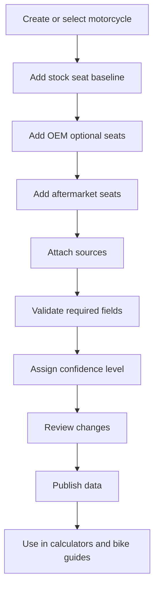

# Data Maintenance Tool Concept

## Purpose

The project needs an internal tool for collecting, validating, maintaining, and extending technical data about:

- motorcycles,
- stock seats,
- premium/OEM comfort seats,
- aftermarket seats,
- DIY material options,
- product sources,
- country availability,
- news and external sources,
- forum/source directory entries,
- user feedback,
- translated summaries,
- source confidence.

This tool is not the public website. It is the back-office workflow that keeps the future public recommendations reliable.

## Working Name

Seat Data Studio for the first module.

Future broader name:

```text
Moto Data Studio
```

The admin tool should be designed so seat data is the first domain, not the only possible domain.

## Main Users

- site owner,
- content editor,
- researcher,
- future contributor,
- reviewer/validator.

## Main Jobs

1. Add a new motorcycle model.
2. Add stock seat technical parameters.
3. Add OEM optional/premium seat options.
4. Add aftermarket seat options.
5. Add material/product categories.
6. Attach sources and evidence.
7. Validate dimensions and compatibility.
8. Mark data quality and confidence.
9. Publish selected data to the public website.
10. Update old data when manufacturers or retailers change information.
11. Manage external news/forum/source links.
12. Moderate rider feedback and submitted links.
13. Approve translated summaries.
14. Add future advisory domains such as tires.

## Core Principle

No recommendation should be stronger than the quality of the underlying data.

Every important data point should answer:

- Where did this come from?
- When was it checked?
- Is it manufacturer data, retailer data, owner measurement, or estimate?
- Is it compatible with which model years?
- How confident are we?

## Data Entry Workflow



## Motorcycle Entry

Required fields:

- brand,
- model,
- generation,
- model years,
- motorcycle category,
- country relevance,
- official source URL,
- research status.

Important technical fields:

- stock seat height,
- wet weight,
- rider ergonomics notes,
- passenger relevance,
- luggage/topcase relevance,
- known variants.

Optional fields:

- wheelbase,
- suspension travel,
- handlebar position notes,
- footpeg position notes,
- official accessory catalog URL.

## Stock Seat Entry

Required:

- motorcycle model,
- seat type: OEM stock,
- source,
- compatible years,
- seat height,
- confidence level.

Recommended:

- seat width front/middle/rear,
- seat slope estimate,
- rider/passenger split,
- cover material,
- foam notes,
- heating availability,
- photos,
- owner measurements,
- known complaints.

## OEM Premium / Optional Seat Entry

This covers manufacturer add-ons such as comfort seats, low seats, high seats, heated seats, touring seats, and accessory catalog seats.

Required:

- motorcycle model,
- manufacturer,
- part name,
- part number if available,
- seat type,
- compatibility,
- official/accessory source URL,
- price if available,
- country availability.

Useful fields:

- height change vs stock,
- heating yes/no,
- passenger version yes/no,
- cover material,
- claimed comfort benefit,
- waterproof claim,
- warranty notes.

## Aftermarket Seat Entry

Examples:

- Sargent,
- Corbin,
- Bagster,
- Touratech,
- Wunderlich,
- SW-Motech,
- Shad,
- Seat Concepts,
- Kahedo,
- local upholsterers.

Required:

- brand,
- product name,
- motorcycle compatibility,
- model years,
- country availability,
- source URL,
- price range,
- confidence level.

Recommended:

- seat height change,
- width,
- foam/material description,
- heating option,
- passenger option,
- return policy,
- delivery country,
- warranty,
- owner review links,
- measured data if available.

## Product Category Entry

Used for affiliate and DIY recommendation blocks.

Categories:

- 3D mesh cover,
- gel pad,
- air cushion,
- comfort foam,
- support foam,
- seat cover material,
- waterproof membrane,
- heating kit,
- contact adhesive,
- upholstery stapler,
- stainless staples,
- sewing thread,
- professional upholstery service.

Fields:

- category name,
- use case,
- problem solved,
- limitations,
- price range,
- DIY difficulty,
- affiliate eligibility,
- country availability.

## Generic Product Entry

Use this for future domains beyond seats.

Examples:

- aftermarket motorcycle seat,
- 3D mesh cover,
- foam sheet,
- upholstery tool,
- motorcycle tire,
- tire pressure gauge,
- windscreen,
- suspension comfort product.

Required:

- domain,
- product type,
- brand,
- product name,
- source URL,
- country availability,
- confidence level.

Recommended:

- variants,
- fitment,
- product attributes,
- offers,
- affiliate links,
- return policy,
- warranty,
- test/review sources,
- forum/user feedback sources.

## Future Tire Entry

If the platform expands into motorcycle tires, tire entries should include:

- tire brand,
- model,
- front/rear usage,
- tire size,
- load index,
- speed rating,
- construction,
- tube/tubeless,
- tire category,
- intended use,
- wet grip notes,
- cold-weather notes,
- mileage expectation,
- comfort/noise notes,
- compatible motorcycles or fitment notes,
- price/offers by country,
- test/review links,
- forum opinion links,
- confidence level.

## Source Model

Each technical claim should be linked to one or more sources.

Source types:

```text
manufacturer_official
manufacturer_accessory_catalog
retailer_product_page
aftermarket_manufacturer
owner_measurement
forum_anecdote
review_article
video_review
manual_or_brochure
estimated
```

Source fields:

- URL,
- title,
- publisher,
- date checked,
- country,
- language,
- source type,
- notes,
- archived copy if allowed,
- confidence contribution.

## News And Source Directory Management

The admin tool should later support curated external sources.

Admin sections:

- content sources,
- news/link queue,
- forum and website directory,
- manufacturer/aftermarket source list,
- upholsterer directory,
- source health checks,
- blocked domains,
- trusted domains.

Admin can configure:

- source name,
- source type,
- country,
- language,
- URL,
- RSS/feed URL if available,
- crawl/feed enabled,
- translation enabled,
- moderation required,
- trust level,
- allowed use mode.

Allowed use modes:

```text
link_only
short_summary
manual_summary
original_content
user_submitted
```

## Feedback And Moderation

The admin tool should support a moderation queue before anything user-submitted is published.

Feedback types:

- seat experience,
- product fitment correction,
- external link suggestion,
- shop/upholsterer suggestion,
- comment,
- bug report,
- translation correction.

Moderation actions:

- approve,
- reject,
- request clarification,
- mark as private research note,
- publish as experience report,
- block as spam.

## Translation Management

Translation should be admin-controlled.

Supported translation workflows:

- native content written directly in target language,
- machine translation draft reviewed by admin,
- short translated summary for external source,
- translated link page pointing to original source.

Do not auto-publish translations without review for core advice, buying recommendations, safety warnings, or affiliate content.

## Confidence Levels

```text
5 - verified official/manufacturer measurement
4 - reputable manufacturer or retailer data
3 - multiple consistent owner/review sources
2 - single anecdotal source
1 - estimate or unverified placeholder
0 - unknown
```

Public pages should show or internally use confidence:

- high confidence: can compare directly,
- medium confidence: show with caveat,
- low confidence: use only as research note.

## Review States

```text
draft
needs_source
needs_measurement
needs_review
approved
published
deprecated
```

## Data Validation Rules

Examples:

- seat height must be numeric and unit-tagged,
- model compatibility must include year range,
- price must include currency,
- source URL is required for published records,
- confidence cannot be high without strong source type,
- aftermarket seat cannot be marked compatible without a compatibility source,
- seat height delta should be calculated from baseline when possible,
- country availability must not be assumed globally.

## Import Methods

### Manual Entry

Best for early phase.

Use forms or structured files:

- motorcycle form,
- stock seat form,
- OEM option form,
- aftermarket seat form,
- source form.

### CSV Import

Useful for bulk data:

- motorcycle list,
- product list,
- retailer price list,
- material list.

Must include:

- import preview,
- validation errors,
- duplicate detection,
- source assignment.

### Structured YAML/JSON

Recommended early before a full database/admin app.

Example:

```yaml
brand: Suzuki
model: GSX-S1000GX
years:
  from: 2024
category: sport_touring_crossover
stock_seat:
  height_mm: null
  confidence: 0
  source: null
research_status: needs_official_specs
```

### Web Research Queue

The tool should support a research backlog:

- target model,
- source to check,
- data expected,
- assigned status,
- notes.

## Duplicate Detection

When adding data, detect duplicates by:

- brand + model + generation,
- seat brand + product name + compatible model,
- part number,
- source URL,
- retailer SKU.

## Versioning

Each record should keep:

- created date,
- updated date,
- updated by,
- data version,
- source verification date,
- change notes.

This matters because seat products disappear, prices change, and compatibility can change.

## Publishing Workflow

Internal data should not automatically appear on public pages.

Recommended flow:

```text
draft -> reviewed -> approved -> published
```

Public pages should consume only:

- approved data,
- published data,
- or clearly marked research notes.

## Future Admin UI

Possible screens:

- Dashboard
- Motorcycles
- Seat Options
- Materials
- Product Categories
- Sources
- Research Queue
- Validation Issues
- Publication Queue
- Affiliate Links
- Change History

## First MVP Of The Tool

Do not build a full admin UI first.

Recommended MVP:

1. Structured YAML/JSON data files.
2. Validation script.
3. Import checklist.
4. Manual review workflow.
5. Generated comparison tables.

Then later:

1. SQLite/PostgreSQL database.
2. Admin forms.
3. Source tracking UI.
4. Public website integration.
