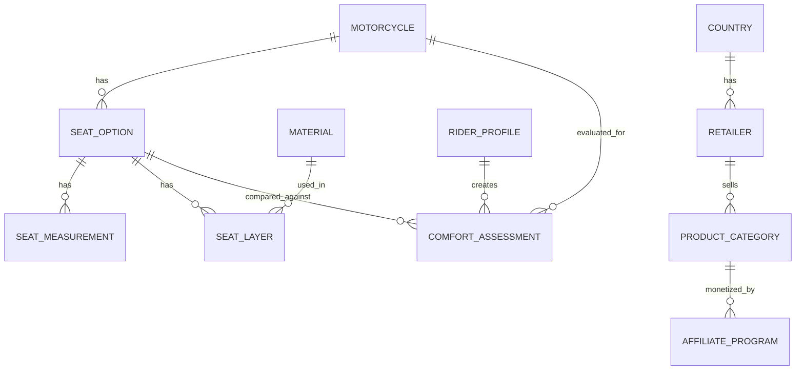

# Data Model Concept

## Purpose

The future website will need structured data for:

- motorcycles,
- stock seats,
- aftermarket seats,
- rider profiles,
- materials,
- product categories,
- countries,
- affiliate sources,
- calculation rules.

This file defines a conceptual data model. It is not yet a database schema.

## Main Entities

## Motorcycle

Fields:

- id,
- brand,
- model,
- generation,
- year_from,
- year_to,
- category,
- country_relevance,
- stock_seat_height_mm,
- wet_weight_kg,
- riding_position_notes,
- passenger_relevance,
- luggage/topcase relevance,
- research_status.

## Seat Option

Types:

- OEM stock,
- OEM comfort,
- aftermarket,
- professional custom,
- DIY plan,
- add-on overlay.

Fields:

- id,
- motorcycle_id,
- brand,
- name,
- type,
- compatible_years,
- rider_seat_height_delta_mm,
- passenger_seat_height_delta_mm,
- width_front_mm,
- width_mid_mm,
- width_rear_mm,
- slope_estimate,
- material_summary,
- heating_available,
- waterproof_claim,
- price_min,
- price_max,
- country_availability,
- source_url,
- confidence_level.

## Rider Profile

Fields:

- id,
- age,
- height_cm,
- weight_kg,
- inseam_cm,
- sit_bone_distance_mm,
- hip_width_estimate,
- riding_experience,
- typical_ride_duration_min,
- target_ride_duration_min,
- pain_start_min,
- pain_location,
- passenger_use,
- climate_use,
- budget_range,
- DIY_skill_level.

## Material

Fields:

- id,
- name,
- category,
- thickness_mm,
- density,
- firmness,
- heat_behavior,
- water_behavior,
- durability,
- DIY_difficulty,
- price_estimate,
- notes.

Categories:

- support foam,
- comfort foam,
- memory foam,
- gel,
- air,
- 3D mesh,
- cover,
- waterproof membrane,
- heating element,
- adhesive,
- hardware.

## Seat Layer

Fields:

- id,
- seat_option_id,
- material_id,
- layer_order,
- thickness_mm,
- coverage_area,
- purpose,
- removable,
- risk_notes.

## Comfort Assessment

Fields:

- id,
- rider_profile_id,
- motorcycle_id,
- seat_option_id,
- estimated_pressure_score,
- estimated_height_risk,
- estimated_heat_risk,
- estimated_long_distance_score,
- DIY_difficulty_score,
- budget_score,
- recommendation_level,
- warnings,
- assumptions.

## Calculation Rule

The calculation rules could be stored as configuration instead of hard-coded logic.

Fields:

- id,
- rule_key,
- version,
- description,
- input_fields,
- output_fields,
- formula_type,
- coefficients_json,
- thresholds_json,
- enabled,
- notes.

Example rule keys:

- `seat_height_reach_risk`
- `pressure_risk_by_weight_and_width`
- `long_ride_comfort_score`
- `heat_risk_by_material_and_climate`
- `diy_difficulty_score`
- `budget_fit_score`

## Why Store Rules As Configuration?

Benefits:

- formulas can evolve without rewriting the whole app,
- assumptions can be documented,
- country/model-specific overrides are possible,
- future admin UI could adjust thresholds.

Risks:

- formulas become hard to understand if too dynamic,
- wrong configuration can produce bad recommendations,
- safety-critical warnings should remain conservative.

Recommended approach:

- keep core calculation code in versioned functions,
- store coefficients and thresholds in configuration,
- show formula version in results.

