# Data Model Concept

## Purpose

The future website will need structured data for:

- motorcycles,
- stock seats,
- aftermarket seats,
- rider profiles,
- rider triangle geometry,
- riding scenarios,
- materials,
- material technical specifications,
- product categories,
- countries,
- affiliate sources,
- product offers,
- recommendation paths,
- news and external sources,
- rider feedback,
- translations,
- moderation,
- visitor continuity,
- consent/cookies,
- analytics/ads,
- calculation rules.

This file defines a conceptual data model. It is not yet a database schema.
For detailed technical fields, see `docs/technical-parameter-model.md`.
For the broader platform architecture, see `docs/platform-architecture.md`.
For visitor continuity, cookies, ads, and privacy notes, see `docs/privacy-visitor-tracking-ads-concept.md`.

## Platform Direction

The current model is seat-first because motorcycle seat comfort is the first product domain. It should not become seat-only.

Future architecture should separate:

- shared platform core,
- motorcycle/vehicle data,
- generic product catalog,
- product offers and affiliate links,
- content/news/source system,
- feedback/community/moderation,
- translation/localization,
- domain-specific modules.

Seat comfort is the first module. Motorcycle tires are a likely future module and should reuse the same vehicle, product, source, affiliate, news, forum, translation, and recommendation systems.

## Main Entities

```mermaid
erDiagram
  MOTORCYCLE ||--o{ SEAT_OPTION : has
  SEAT_OPTION ||--o{ SEAT_MEASUREMENT : has
  SEAT_OPTION ||--o{ SEAT_LAYER : has
  MATERIAL ||--o{ SEAT_LAYER : used_in
  MOTORCYCLE ||--o{ MOTORCYCLE_GEOMETRY : has
  MOTORCYCLE ||--o{ RIDER_TRIANGLE_MEASUREMENT : has
  RIDER_PROFILE ||--o{ COMFORT_ASSESSMENT : creates
  RIDER_PROFILE ||--o{ RIDING_SCENARIO : uses
  MOTORCYCLE ||--o{ COMFORT_ASSESSMENT : evaluated_for
  SEAT_OPTION ||--o{ COMFORT_ASSESSMENT : compared_against
  COUNTRY ||--o{ RETAILER : has
  RETAILER ||--o{ PRODUCT_CATEGORY : sells
  PRODUCT_CATEGORY ||--o{ AFFILIATE_PROGRAM : monetized_by
  DOMAIN ||--o{ PRODUCT : contains
  PRODUCT ||--o{ PRODUCT_VARIANT : has
  PRODUCT ||--o{ PRODUCT_FITMENT : fits
  PRODUCT ||--o{ PRODUCT_ATTRIBUTE : describes
  SEAT_OPTION ||--o{ PRODUCT_OFFER : sold_as
  PRODUCT ||--o{ PRODUCT_OFFER : sold_as
  RETAILER ||--o{ PRODUCT_OFFER : lists
  RIDER_PROFILE ||--o{ RECOMMENDATION_RESULT : receives
  CONTENT_SOURCE ||--o{ NEWS_ITEM : publishes
  CONTENT_SOURCE ||--o{ EXTERNAL_LINK : references
  NEWS_ITEM ||--o{ TRANSLATED_CONTENT : translated_as
  USER_FEEDBACK ||--o{ TRANSLATED_CONTENT : translated_as
  USER_FEEDBACK ||--o{ MODERATION_EVENT : reviewed_by
  VISITOR ||--o{ VISITOR_SESSION : has
  VISITOR ||--o{ CONSENT_RECORD : gives
  VISITOR ||--o{ VISITOR_STATE : saves
  VISITOR_SESSION ||--o{ ANALYTICS_EVENT : records
  PRODUCT_OFFER ||--o{ AFFILIATE_CLICK : clicked_as
```

## Domain

Represents a major advisory area.

Examples:

- seat comfort,
- tires,
- wind protection,
- luggage,
- suspension comfort,
- tools/workshop.

Fields:

- id,
- key,
- name,
- description,
- enabled,
- public_slug,
- admin_enabled,
- notes.

## Product

Generic product record used across seats, tires, tools, and other future areas.

Fields:

- id,
- domain_id,
- brand,
- name,
- product_type,
- description,
- manufacturer_url,
- country_availability,
- source_url,
- confidence_level,
- status.

## Product Variant

Fields:

- id,
- product_id,
- name,
- sku,
- part_number,
- variant_type,
- attributes_json,
- source_url,
- confidence_level.

Examples:

- heated seat variant,
- low seat variant,
- tire size variant,
- foam sheet thickness variant.

## Product Fitment

Fields:

- id,
- product_id,
- product_variant_id,
- motorcycle_id,
- fitment_type,
- year_from,
- year_to,
- market,
- source_url,
- confidence_level,
- notes.

For tires, fitment may reference tire size and motorcycle compatibility instead of a direct model-only claim.

## Product Attribute

Generic domain-specific attribute record.

Fields:

- id,
- product_id,
- product_variant_id,
- domain,
- attribute_key,
- value,
- unit,
- source_url,
- confidence_level,
- notes.

Examples:

- `seat_height_delta_mm`,
- `heating_available`,
- `foam_density_kg_m3`,
- `tire_width_mm`,
- `tire_aspect_ratio`,
- `tire_rim_diameter_in`,
- `tire_speed_rating`,
- `tire_load_index`.

## Motorcycle

Fields:

- id,
- brand,
- model,
- generation,
- year_from,
- year_to,
- category,
- country_relevance,
- stock_seat_height_mm,
- wet_weight_kg,
- payload_capacity_kg,
- wheelbase_mm,
- front_suspension_travel_mm,
- rear_suspension_travel_mm,
- rider_sag_estimate_mm,
- wind_protection_level,
- riding_position_notes,
- footpeg_position_notes,
- handlebar_position_notes,
- passenger_relevance,
- luggage/topcase relevance,
- research_status.

## Motorcycle Geometry

Fields:

- id,
- motorcycle_id,
- coordinate_system,
- seat_reference_x_mm,
- seat_reference_y_mm,
- seat_reference_z_mm,
- lowest_seat_point_x_mm,
- lowest_seat_point_y_mm,
- lowest_seat_point_z_mm,
- handlebar_grip_x_mm,
- handlebar_grip_y_mm,
- handlebar_grip_z_mm,
- footpeg_x_mm,
- footpeg_y_mm,
- footpeg_z_mm,
- passenger_peg_x_mm,
- passenger_peg_y_mm,
- passenger_peg_z_mm,
- measurement_method,
- source_url,
- confidence_level.

## Rider Triangle Measurement

Fields:

- id,
- motorcycle_id,
- seat_option_id,
- rider_profile_id,
- hip_to_knee_distance_mm,
- knee_angle_deg,
- hip_angle_deg,
- forward_lean_deg,
- handlebar_reach_mm,
- footpeg_drop_from_seat_mm,
- footpeg_rearward_offset_mm,
- assumptions,
- formula_version,
- confidence_level.

## Seat Option

Types:

- OEM stock,
- OEM comfort,
- aftermarket,
- professional custom,
- DIY plan,
- add-on overlay.

Fields:

- id,
- motorcycle_id,
- brand,
- name,
- type,
- compatible_years,
- rider_seat_height_delta_mm,
- passenger_seat_height_delta_mm,
- width_front_mm,
- width_sit_bone_zone_mm,
- width_mid_mm,
- width_rear_mm,
- usable_rider_length_mm,
- effective_support_area_cm2,
- slope_estimate,
- crown_radius_estimate,
- pocket_depth_mm,
- step_height_to_passenger_mm,
- cover_friction_level,
- seam_pressure_risk,
- material_summary,
- heating_available,
- waterproof_claim,
- price_min,
- price_max,
- country_availability,
- source_url,
- confidence_level.

## Rider Profile

Fields:

- id,
- age,
- height_cm,
- weight_kg,
- inseam_cm,
- sit_bone_distance_mm,
- hip_width_estimate,
- riding_experience,
- typical_ride_duration_min,
- target_ride_duration_min,
- pain_start_min,
- pain_location,
- passenger_use,
- climate_use,
- riding_scenario_mix,
- boot_sole_height_mm,
- torso_length_cm,
- arm_length_cm,
- thigh_length_cm,
- lower_leg_length_cm,
- budget_range,
- DIY_skill_level.

## Riding Scenario

Fields:

- id,
- rider_profile_id,
- scenario_type,
- average_speed_kmh,
- speed_range_kmh,
- duration_min,
- stop_frequency,
- acceleration_intensity,
- braking_intensity,
- cornering_intensity,
- seated_percentage,
- standing_percentage,
- road_roughness,
- wind_exposure,
- ambient_temperature_c,
- rain_or_wet_use,
- luggage_weight_kg,
- passenger_weight_kg,
- notes.

## Material

Fields:

- id,
- name,
- category,
- thickness_mm,
- density,
- firmness,
- ild_25_percent,
- ild_40_percent,
- compression_set,
- rebound_resilience,
- tensile_strength,
- elongation,
- tear_strength,
- temperature_range,
- heat_behavior,
- water_behavior,
- breathability,
- glue_compatibility,
- cover_compatibility,
- durability,
- DIY_difficulty,
- price_estimate,
- notes.

Categories:

- support foam,
- comfort foam,
- memory foam,
- gel,
- air,
- 3D mesh,
- cover,
- waterproof membrane,
- heating element,
- adhesive,
- hardware.

## Seat Layer

Fields:

- id,
- seat_option_id,
- material_id,
- layer_order,
- thickness_mm,
- coverage_area,
- purpose,
- removable,
- risk_notes.

## Comfort Assessment

Fields:

- id,
- rider_profile_id,
- motorcycle_id,
- seat_option_id,
- estimated_pressure_score,
- estimated_height_risk,
- estimated_knee_angle_risk,
- estimated_hip_angle_risk,
- estimated_seat_load_kg,
- estimated_braking_slide_risk,
- estimated_highway_load_score,
- estimated_offroad_impact_risk,
- estimated_heat_risk,
- estimated_long_distance_score,
- DIY_difficulty_score,
- budget_score,
- recommendation_level,
- warnings,
- assumptions.

## Solution Path

Represents a human-friendly path before a specific product is selected.

Types:

- keep stock and test posture,
- reversible add-on,
- OEM accessory seat,
- aftermarket seat,
- professional upholsterer,
- DIY modification,
- spare-seat experiment.

Fields:

- id,
- name,
- type,
- best_for,
- not_ideal_for,
- expected_benefit,
- likely_downside,
- cost_level,
- effort_level,
- reversibility,
- ride_type_fit,
- confidence_level,
- notes.

## Product Offer

Represents a concrete purchasable option.

Fields:

- id,
- seat_option_id,
- retailer_id,
- country,
- product_name,
- product_type,
- price,
- currency,
- availability_status,
- shipping_notes,
- return_policy_notes,
- warranty_notes,
- source_url,
- affiliate_url,
- affiliate_disclosure_required,
- last_verified_at,
- fitment_confidence,
- comfort_claim_source,
- notes.

## Recommendation Result

Represents the output shown to a user.

Fields:

- id,
- rider_profile_id,
- motorcycle_id,
- scenario_id,
- primary_problem_category,
- recommended_solution_path_ids,
- product_offer_ids,
- warnings,
- why_recommended,
- why_not_other_options,
- cheaper_alternatives,
- reversible_alternatives,
- affiliate_disclosure,
- confidence_level,
- missing_data,
- formula_version,
- created_at.

## Content Source

Represents a configured external source.

Types:

- motorcycle news website,
- motorcycle forum,
- manufacturer page,
- aftermarket manufacturer,
- retailer blog,
- upholsterer website,
- Reddit/community page,
- YouTube channel,
- owner club,
- manual/admin source.

Fields:

- id,
- name,
- source_type,
- website_url,
- feed_url,
- country,
- language,
- topic_categories,
- seat_comfort_relevance,
- allowed_use,
- feed_enabled,
- translation_enabled,
- moderation_required,
- trust_level,
- last_checked_at,
- notes.

## News Item

Represents an admin-curated external news/link item.

Fields:

- id,
- source_id,
- title_original,
- title_translated,
- summary_original,
- summary_translated,
- source_url,
- canonical_url,
- original_language,
- target_language,
- country_relevance,
- motorcycle_model_relevance,
- topic_tags,
- published_at,
- discovered_at,
- translation_status,
- moderation_status,
- copyright_mode,
- confidence_level,
- admin_notes.

## External Link

Represents a directory link to a forum, community, shop, manufacturer, upholsterer, or useful website.

Fields:

- id,
- source_id,
- title,
- url,
- link_type,
- country,
- language,
- motorcycle_brand,
- motorcycle_model,
- topic_tags,
- registration_required,
- quality_notes,
- trust_level,
- last_verified_at,
- admin_notes.

## User Feedback

Represents feedback, submitted links, and rider experience reports.

Fields:

- id,
- display_name,
- email_private,
- country,
- language,
- motorcycle_brand,
- motorcycle_model,
- motorcycle_year,
- seat_type,
- ride_duration_before_pain_min,
- problem_description,
- solution_tried,
- result_summary,
- cost,
- source_link,
- permission_to_publish,
- moderation_status,
- spam_score,
- admin_notes,
- created_at.

## Translated Content

Represents a translated summary or translated user feedback.

Fields:

- id,
- source_entity_type,
- source_entity_id,
- source_language,
- target_language,
- translation_mode,
- translated_title,
- translated_summary,
- translator,
- machine_translation_provider,
- admin_review_status,
- published,
- created_at,
- updated_at.

## Moderation Event

Represents admin review of feedback, comments, source links, or news items.

Fields:

- id,
- entity_type,
- entity_id,
- moderator,
- action,
- reason,
- notes,
- created_at.

## Visitor

Represents an anonymous or future logged-in visitor.

Fields:

- id,
- anonymous_id,
- account_id,
- first_seen_at,
- last_seen_at,
- country_guess,
- preferred_language,
- preferred_country,
- consent_status_summary,
- created_at,
- updated_at.

Do not store raw IP address on the visitor profile.

## Visitor Session

Fields:

- id,
- visitor_id,
- session_token_hash,
- started_at,
- last_seen_at,
- user_agent_hash,
- ip_hash_or_truncated,
- country_guess,
- referrer_domain,
- landing_page,
- consent_snapshot_id,
- security_flags.

## Consent Record

Fields:

- id,
- visitor_id,
- session_id,
- consent_version,
- necessary_enabled,
- preferences_enabled,
- analytics_enabled,
- advertising_enabled,
- affiliate_tracking_enabled,
- consent_source,
- country,
- language,
- created_at,
- withdrawn_at.

## Visitor State

Stores progress so a returning visitor can continue where they stopped.

Fields:

- id,
- visitor_id,
- state_type,
- domain,
- state_json,
- expires_at,
- created_at,
- updated_at.

Examples:

- questionnaire progress,
- chosen motorcycle,
- selected country/language,
- comparison shortlist,
- DIY plan draft,
- saved recommendation.

## Analytics Event

Fields:

- id,
- visitor_id,
- session_id,
- event_type,
- domain,
- page_path,
- entity_type,
- entity_id,
- referrer_domain,
- consent_snapshot_id,
- event_data_json,
- created_at.

Store only when allowed by consent/configuration.

## Affiliate Click

Fields:

- id,
- visitor_id,
- session_id,
- product_offer_id,
- retailer_id,
- affiliate_program_id,
- source_page,
- canonical_url,
- affiliate_url,
- disclosure_shown,
- consent_snapshot_id,
- created_at.

## Sponsored Link

Fields:

- id,
- placement_key,
- sponsor_name,
- target_url,
- country,
- language,
- domain,
- starts_at,
- ends_at,
- paid_relationship_type,
- disclosure_text,
- enabled,
- notes.

## Calculation Rule

The calculation rules could be stored as configuration instead of hard-coded logic.

Fields:

- id,
- rule_key,
- version,
- description,
- input_fields,
- output_fields,
- formula_type,
- coefficients_json,
- thresholds_json,
- enabled,
- notes.

Example rule keys:

- `seat_height_reach_risk`
- `pressure_risk_by_weight_and_width`
- `seat_load_by_posture_and_scenario`
- `rider_triangle_knee_angle`
- `rider_triangle_hip_angle`
- `braking_slide_risk`
- `offroad_impact_risk`
- `long_ride_comfort_score`
- `heat_risk_by_material_and_climate`
- `diy_difficulty_score`
- `budget_fit_score`

## Why Store Rules As Configuration?

Benefits:

- formulas can evolve without rewriting the whole app,
- assumptions can be documented,
- country/model-specific overrides are possible,
- future admin UI could adjust thresholds.

Risks:

- formulas become hard to understand if too dynamic,
- wrong configuration can produce bad recommendations,
- safety-critical warnings should remain conservative.

Recommended approach:

- keep core calculation code in versioned functions,
- store coefficients and thresholds in configuration,
- show formula version in results.
