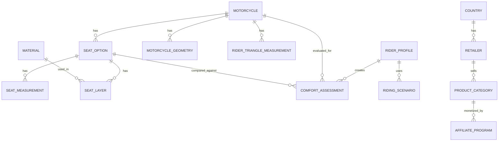

# Data Model Concept

## Purpose

The future website will need structured data for:

- motorcycles,
- stock seats,
- aftermarket seats,
- rider profiles,
- rider triangle geometry,
- riding scenarios,
- materials,
- material technical specifications,
- product categories,
- countries,
- affiliate sources,
- calculation rules.

This file defines a conceptual data model. It is not yet a database schema.
For detailed technical fields, see `docs/technical-parameter-model.md`.

## Main Entities

## Motorcycle

Fields:

- id,
- brand,
- model,
- generation,
- year_from,
- year_to,
- category,
- country_relevance,
- stock_seat_height_mm,
- wet_weight_kg,
- payload_capacity_kg,
- wheelbase_mm,
- front_suspension_travel_mm,
- rear_suspension_travel_mm,
- rider_sag_estimate_mm,
- wind_protection_level,
- riding_position_notes,
- footpeg_position_notes,
- handlebar_position_notes,
- passenger_relevance,
- luggage/topcase relevance,
- research_status.

## Motorcycle Geometry

Fields:

- id,
- motorcycle_id,
- coordinate_system,
- seat_reference_x_mm,
- seat_reference_y_mm,
- seat_reference_z_mm,
- lowest_seat_point_x_mm,
- lowest_seat_point_y_mm,
- lowest_seat_point_z_mm,
- handlebar_grip_x_mm,
- handlebar_grip_y_mm,
- handlebar_grip_z_mm,
- footpeg_x_mm,
- footpeg_y_mm,
- footpeg_z_mm,
- passenger_peg_x_mm,
- passenger_peg_y_mm,
- passenger_peg_z_mm,
- measurement_method,
- source_url,
- confidence_level.

## Rider Triangle Measurement

Fields:

- id,
- motorcycle_id,
- seat_option_id,
- rider_profile_id,
- hip_to_knee_distance_mm,
- knee_angle_deg,
- hip_angle_deg,
- forward_lean_deg,
- handlebar_reach_mm,
- footpeg_drop_from_seat_mm,
- footpeg_rearward_offset_mm,
- assumptions,
- formula_version,
- confidence_level.

## Seat Option

Types:

- OEM stock,
- OEM comfort,
- aftermarket,
- professional custom,
- DIY plan,
- add-on overlay.

Fields:

- id,
- motorcycle_id,
- brand,
- name,
- type,
- compatible_years,
- rider_seat_height_delta_mm,
- passenger_seat_height_delta_mm,
- width_front_mm,
- width_sit_bone_zone_mm,
- width_mid_mm,
- width_rear_mm,
- usable_rider_length_mm,
- effective_support_area_cm2,
- slope_estimate,
- crown_radius_estimate,
- pocket_depth_mm,
- step_height_to_passenger_mm,
- cover_friction_level,
- seam_pressure_risk,
- material_summary,
- heating_available,
- waterproof_claim,
- price_min,
- price_max,
- country_availability,
- source_url,
- confidence_level.

## Rider Profile

Fields:

- id,
- age,
- height_cm,
- weight_kg,
- inseam_cm,
- sit_bone_distance_mm,
- hip_width_estimate,
- riding_experience,
- typical_ride_duration_min,
- target_ride_duration_min,
- pain_start_min,
- pain_location,
- passenger_use,
- climate_use,
- riding_scenario_mix,
- boot_sole_height_mm,
- torso_length_cm,
- arm_length_cm,
- thigh_length_cm,
- lower_leg_length_cm,
- budget_range,
- DIY_skill_level.

## Riding Scenario

Fields:

- id,
- rider_profile_id,
- scenario_type,
- average_speed_kmh,
- speed_range_kmh,
- duration_min,
- stop_frequency,
- acceleration_intensity,
- braking_intensity,
- cornering_intensity,
- seated_percentage,
- standing_percentage,
- road_roughness,
- wind_exposure,
- ambient_temperature_c,
- rain_or_wet_use,
- luggage_weight_kg,
- passenger_weight_kg,
- notes.

## Material

Fields:

- id,
- name,
- category,
- thickness_mm,
- density,
- firmness,
- ild_25_percent,
- ild_40_percent,
- compression_set,
- rebound_resilience,
- tensile_strength,
- elongation,
- tear_strength,
- temperature_range,
- heat_behavior,
- water_behavior,
- breathability,
- glue_compatibility,
- cover_compatibility,
- durability,
- DIY_difficulty,
- price_estimate,
- notes.

Categories:

- support foam,
- comfort foam,
- memory foam,
- gel,
- air,
- 3D mesh,
- cover,
- waterproof membrane,
- heating element,
- adhesive,
- hardware.

## Seat Layer

Fields:

- id,
- seat_option_id,
- material_id,
- layer_order,
- thickness_mm,
- coverage_area,
- purpose,
- removable,
- risk_notes.

## Comfort Assessment

Fields:

- id,
- rider_profile_id,
- motorcycle_id,
- seat_option_id,
- estimated_pressure_score,
- estimated_height_risk,
- estimated_knee_angle_risk,
- estimated_hip_angle_risk,
- estimated_seat_load_kg,
- estimated_braking_slide_risk,
- estimated_highway_load_score,
- estimated_offroad_impact_risk,
- estimated_heat_risk,
- estimated_long_distance_score,
- DIY_difficulty_score,
- budget_score,
- recommendation_level,
- warnings,
- assumptions.

## Calculation Rule

The calculation rules could be stored as configuration instead of hard-coded logic.

Fields:

- id,
- rule_key,
- version,
- description,
- input_fields,
- output_fields,
- formula_type,
- coefficients_json,
- thresholds_json,
- enabled,
- notes.

Example rule keys:

- `seat_height_reach_risk`
- `pressure_risk_by_weight_and_width`
- `seat_load_by_posture_and_scenario`
- `rider_triangle_knee_angle`
- `rider_triangle_hip_angle`
- `braking_slide_risk`
- `offroad_impact_risk`
- `long_ride_comfort_score`
- `heat_risk_by_material_and_climate`
- `diy_difficulty_score`
- `budget_fit_score`

## Why Store Rules As Configuration?

Benefits:

- formulas can evolve without rewriting the whole app,
- assumptions can be documented,
- country/model-specific overrides are possible,
- future admin UI could adjust thresholds.

Risks:

- formulas become hard to understand if too dynamic,
- wrong configuration can produce bad recommendations,
- safety-critical warnings should remain conservative.

Recommended approach:

- keep core calculation code in versioned functions,
- store coefficients and thresholds in configuration,
- show formula version in results.
