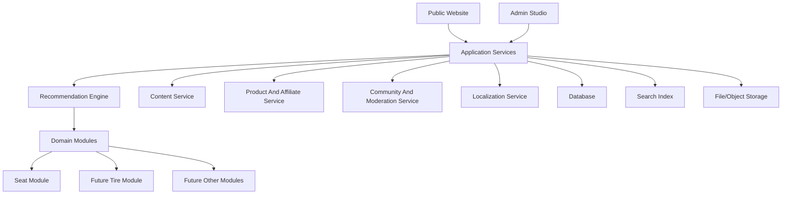

# Platform Architecture

Status: concept draft

Purpose: define a robust, extensible architecture for Moto Seat Lab as a motorcycle advisory platform. Seats are the first module, but the platform should later support other domains such as motorcycle tires, luggage, screens, suspension comfort, tools, and maintenance products.

## Core Architectural Idea

Do not build only a seat website.

Build a motorcycle advisory platform with:

- shared platform core,
- domain modules,
- content and source system,
- product and affiliate system,
- recommendation engine,
- admin/moderation workflow,
- localization and translation layer.

Seats become the first domain module:

```text
Platform Core
  -> Seat Comfort Module
  -> Future Tire Advisor Module
  -> Future Wind Protection Module
  -> Future Suspension Comfort Module
  -> Future Tools And Workshop Module
```

## Recommended Layered Architecture



For the first implementation, these services do not need to be separate servers. They can be folders/modules inside one application. The boundaries should still be clear.

## Shared Platform Core

The shared core should know about:

- motorcycles,
- users/admins later,
- countries,
- languages,
- currencies,
- units,
- sources,
- products,
- retailers,
- offers,
- affiliate programs,
- content pages,
- news/link items,
- feedback,
- moderation,
- translations,
- recommendation results,
- confidence/source quality.

This core should not know seat-specific foam calculations or tire-specific grip/wet-weather logic.

## Domain Modules

Each advisory domain should define its own:

- domain-specific inputs,
- technical parameters,
- calculation rules,
- recommendation warnings,
- comparison dimensions,
- content templates,
- product categories,
- maintenance workflow.

### Seat Module

Specific concepts:

- seat option,
- seat measurement,
- seat layer,
- foam/material stack,
- rider triangle,
- pressure/heat/reach risk,
- DIY seat plan,
- upholsterer path.

### Future Tire Module

Specific concepts:

- tire size,
- load index,
- speed rating,
- tire construction,
- tire compound,
- sport/touring/adventure/off-road category,
- wet grip,
- cold-weather behavior,
- mileage expectation,
- noise,
- comfort,
- homologation/fitment,
- tire pressure recommendations,
- user riding style,
- product tests,
- forum opinions,
- price/availability by country.

The same platform systems can handle:

- tire news,
- tire forum links,
- tire product offers,
- affiliate links,
- owner feedback,
- translated summaries,
- confidence levels.

## Data Architecture Recommendation

Use a hybrid model:

1. Relational database for stable structured data.
2. JSON fields for module-specific technical details.
3. Full-text/search index for news, forum links, feedback, and content.
4. Versioned structured files in early MVP before full admin UI.

Recommended future database:

- PostgreSQL as primary database,
- JSONB for flexible domain attributes,
- generated/search columns where needed,
- full-text search first via PostgreSQL, dedicated search engine only later.

Avoid early:

- multiple databases,
- microservices,
- graph database,
- event streaming,
- complex CMS,
- uncontrolled scraping system.

## Shared Data Model Groups

### 1. Vehicle Core

Purpose:

- represent motorcycle models once and reuse them across seats, tires, luggage, screens, suspension, and tools.

Entities:

- `vehicle`
- `vehicle_generation`
- `vehicle_market_variant`
- `vehicle_specification`
- `vehicle_fitment`
- `vehicle_source`

Recommendation:

- keep current `motorcycle` concept,
- later rename or generalize internally to `vehicle`,
- keep public wording as motorcycle.

### 2. Domain And Taxonomy

Purpose:

- make seats, tires, tools, and other future areas configurable modules.

Entities:

- `domain`
- `domain_category`
- `topic`
- `tag`
- `attribute_definition`
- `attribute_value`

Examples:

- domain: `seat_comfort`
- domain: `tires`
- attribute: `foam_density_kg_m3`
- attribute: `tire_width_mm`
- attribute: `wet_grip_rating`

### 3. Product Catalog

Purpose:

- avoid hard-coding products as only seats.

Entities:

- `product`
- `product_variant`
- `product_fitment`
- `product_attribute`
- `product_offer`
- `retailer`
- `affiliate_program`
- `affiliate_link`

Seat example:

- product type: aftermarket seat
- fitment: Suzuki GSX-S1000GX 2024-
- attributes: seat height delta, heating, width.

Tire example:

- product type: tire
- fitment: tire size and motorcycle compatibility notes
- attributes: size, speed index, load index, category, wet grip, mileage.

### 4. Recommendation Core

Purpose:

- keep recommendation outputs consistent across domains.

Entities:

- `user_intent`
- `use_case`
- `recommendation_session`
- `recommendation_result`
- `solution_path`
- `recommendation_rule`
- `recommendation_warning`
- `comparison_dimension`

Examples:

- seat solution path: OEM comfort seat, aftermarket seat, DIY, upholsterer.
- tire solution path: sport touring tire, wet-weather tire, budget commuter tire, adventure 80/20 tire.

### 5. Content And Source System

Purpose:

- handle articles, news, source directory, external links, forum references, and translated summaries.

Entities:

- `content_page`
- `content_block`
- `content_source`
- `news_item`
- `external_link`
- `source_check`
- `translated_content`
- `source_confidence`

Important rule:

- external content should be linked and summarized, not copied wholesale.

### 6. Community And Moderation

Purpose:

- support feedback, mini forum, owner reports, and corrections without chaos.

Entities:

- `user_feedback`
- `experience_report`
- `comment_thread`
- `comment`
- `moderation_event`
- `spam_signal`
- `report`

Start with feedback and moderation queue. Add forum only later.

### 7. Localization

Purpose:

- support countries, languages, currencies, units, translated summaries, and local buying options.

Entities:

- `country`
- `language`
- `locale_setting`
- `translation_job`
- `translated_content`
- `localized_offer`
- `localized_disclosure`

## Forum Architecture

Recommended path:

### Phase 1: No Forum, Only Feedback

- simple feedback form,
- link submission,
- product fitment correction,
- owner experience report,
- admin moderation.

Why:

- easiest to control,
- low spam surface,
- useful data collection,
- no user account system required.

### Phase 2: Comments Under Guides

- one moderated thread per article/bike guide/product comparison,
- anonymous or simple email identity optional,
- spam protection,
- admin approval before publishing.

### Phase 3: Mini Forum

Only if there is real traffic:

- categories by domain and motorcycle model,
- threads,
- comments,
- user accounts,
- moderation roles,
- report abuse,
- trust/reputation markers.

Recommended entities:

- `discussion_category`
- `discussion_thread`
- `discussion_post`
- `discussion_subscription`
- `moderation_event`
- `user_profile`

Keep forum posts separate from verified technical data.

Forum posts can influence:

- research backlog,
- anecdotal confidence,
- pain-point discovery,
- product complaint signals.

Forum posts should not directly create strong recommendations without review.

## News Architecture

Recommended path:

### Phase 1: Manual News Links

- admin adds title, source, URL, short summary, tags.
- no crawler needed.

### Phase 2: Feed Discovery

- RSS/feed fetch creates draft items,
- duplicate detection,
- admin approves,
- short summary and translation added.

### Phase 3: Source Monitoring

- source health checks,
- stale link detection,
- topic classifier,
- moderation queue.

Recommended entities:

- `content_source`
- `source_check`
- `news_item`
- `news_topic`
- `translated_content`
- `moderation_event`

Important:

- store source URL and copyright mode,
- never depend on copied full text,
- allow source-specific rules.

## Affiliate Architecture

Affiliate links should be attached to offers, not hard-coded in article text.

Recommended entities:

- `retailer`
- `affiliate_program`
- `affiliate_link`
- `product_offer`
- `localized_offer`
- `affiliate_disclosure`

Rules:

- recommendations rank by fit, not affiliate value,
- affiliate disclosure is shown near links,
- non-affiliate alternatives can still be recommended,
- stale price/availability must be detectable,
- affiliate URLs are generated or stored separately from canonical product URLs.

This lets the same system support:

- seat products,
- foam and tools,
- tires,
- tire pressure gauges,
- motorcycle accessories.

## Materials And Tools Architecture

Current seat materials should be generalized into products plus technical attributes.

Keep:

- seat-specific material stack logic.

Generalize:

- material/product catalog,
- product offers,
- affiliate links,
- source confidence,
- country availability.

For future tires, "materials" becomes less central, but product attributes become more important.

## Recommendation Function Architecture

Use a pipeline:

```text
collect inputs
normalize inputs
load vehicle data
load domain data
load product/options
run domain-specific scoring
apply warnings
rank solution paths
attach offers and links
localize result
show confidence and missing data
```

Shared functions:

- locale resolution,
- unit conversion,
- source confidence scoring,
- offer filtering,
- affiliate disclosure,
- missing-data detection,
- recommendation result formatting.

Seat-specific functions:

- seat height impact,
- reach risk,
- pressure risk,
- heat risk,
- rider triangle risk,
- DIY difficulty.

Future tire-specific functions:

- tire size fitment check,
- use-case match,
- wet/cold/sport/touring score,
- mileage expectation score,
- price/value score,
- forum/test confidence aggregation.

## Admin Studio Architecture

Admin Studio should manage all domains through shared screens plus domain-specific editors.

Shared screens:

- dashboard,
- vehicles,
- products,
- offers,
- retailers,
- affiliate links,
- sources,
- news queue,
- feedback queue,
- translation queue,
- moderation queue,
- validation issues,
- publication queue.

Seat-specific screens:

- seat options,
- seat measurements,
- material stacks,
- DIY plans,
- upholsterer entries.

Future tire-specific screens:

- tire products,
- tire sizes,
- fitment notes,
- test references,
- owner reports,
- tire use-case scoring.

## MVP Architecture Recommendation

Do not build the final platform immediately.

Recommended implementation sequence:

1. Static content and markdown.
2. Structured JSON/YAML data files.
3. Validation scripts.
4. Public pages generated from data.
5. Basic recommendation functions in code.
6. PostgreSQL when data volume and admin workflow justify it.
7. Admin Studio after schemas stabilize.
8. News/source directory manually first.
9. Feedback form with moderation.
10. Forum only after real demand.

## Key Refactor Needed In Current Model

Current model is seat-first. That is good for MVP but should evolve:

- keep seat-specific entities for calculations,
- introduce generic `product`, `product_offer`, `domain`, `content_source`, and `recommendation_result`,
- avoid naming every future purchasable item as a `seat_option`,
- use domain-specific extensions for seats and later tires.

This gives the project room to become:

```text
Moto Seat Lab
  -> Moto Comfort Lab
  -> Motorcycle advisory network
```

without rewriting the core data architecture.
